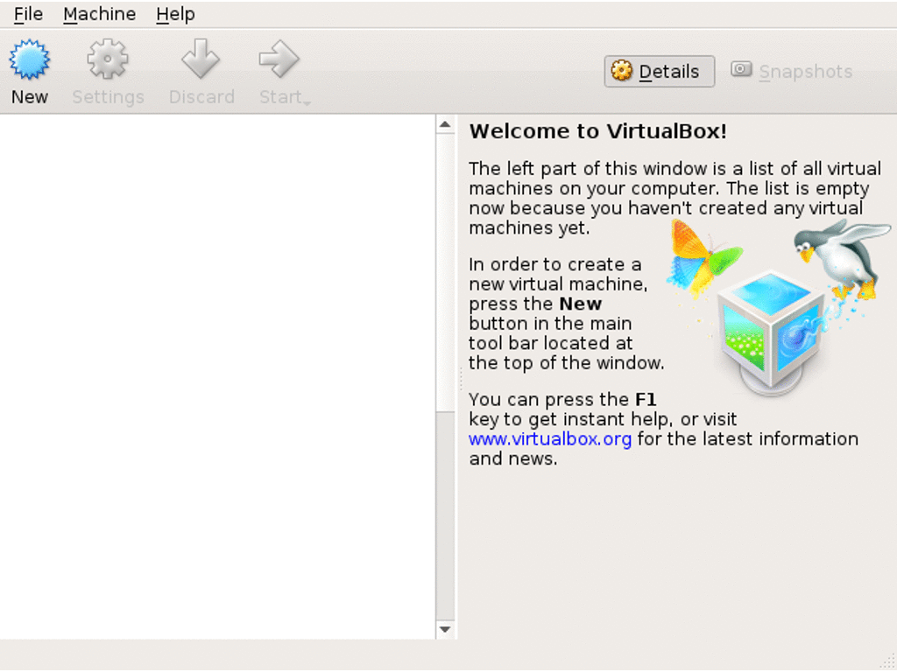

Self-Installing Windows OVA
===========================
_because I can't distribute Windows_

Overview
--------

This is an Virtual Machine in OVA format that will install Windows ontop of
itself. I wrote this as an alternative to [packer](https://www.packer.io). This
OVA basically downloads the evaluation version of the Windows version you select
to one drive as installation media and then installs onto the primary drive.
After this is done, the smaller secondary drive can be discarded to save disk
space. If the default size of the primary drive is not large enough, it should
be resized BEFORE booting the OVA for the first time.



Customizing
-----------

This OVA supports being repackaged with an ISO for further customization.
Simply add at least one file, `install.cmd` to an iso and attach it before
booting the OVA for the first time.

Contents for an example iso are in the `iso/` directory. There is also a
`Makefile` target for building this iso, `example.iso`.

### install.cmd
This is simply run at first login after install. Place things in here like
silent installation instructions for programs either off the same iso or
downloaded from the internet.

### variables.txt
This file should set at least one variable.

#### `version`
This should be one of the following keys:

|key      |Version                 |
|---------|------------------------|
|win2k16  |Windows 2016 Standard   |
|win10-64 |Windows 10 64-bit       |
|win10-32 |Windows 10 32-bit       |
|win2k12r2|Windows 2012 R2 Standard|
|win81-64 |Windows 8.1 64-bit      |
|win81-32 |Windows 8.1 32-bit      |
|win8-64  |Windows 8 64-bit        |
|win8-32  |Windows 8 32-bit        |
|win2k8r2 |Windows 2008 R2 Standard|
|win7-64  |Windows 7 64-bit        |
|win7-32  |Windows 7 32-bit        |

#### `localmirror`
This should be the absolute address of a local mirror for ISOs. It can also be `"none"` for no mirror and no prompt. This allows truly unattended installation.


#### Example `variables.txt`
```
version=win10-64
localmirror=http://192.168.0.1/isos/
```

### Autounattend.xml
If this file is present on the ISO, in a directory named for the version key
being installed, it will be used instead of an `Autounattend.xml` from the
[boxcutter](https://github.com/boxcutter/windows) project. One gotcha is how
Windows 7 and Windows 2008 think the install media is DriveID 0 and the actual
"C" drive is DriveID 1. Keep that in mind when crafting answer files for these
versions.

Building
--------
To build this, start with a debian system and install virtualbox and the
following:
```
apt-get install pv multistrap debian-archive-keyring rsync kpartx genisoimage
```

Specifically for the `make vbox` target, a previous OVA needs to be imported or
at least a VM needs to exist in virtualbox with the name "Windows".
